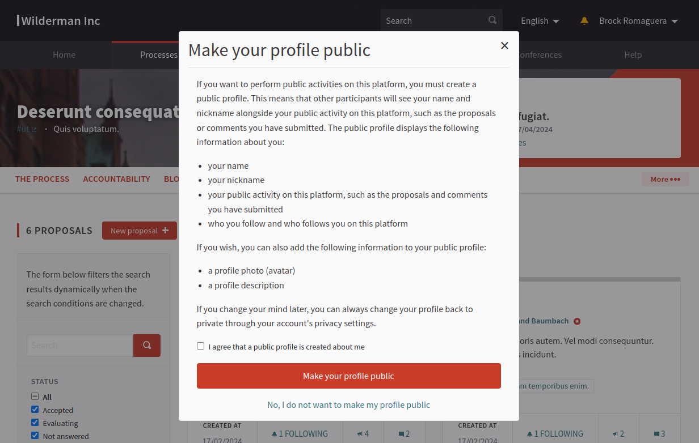

# Decidim::Privacy

In a regular Decidim installation, all user accounts registered on the platform
are public by default and a public profile is created for every user on the
platform automatically. This principle comes from the social aspect of the
platform which encourages people to act using their own names rather than
keeping all discussion anonymous. The public profiles only include information
that is supposed to be public, not any private information such as the user's
email address or their identity details.

This is also a very good principle in general for any platform dealing with
democracy, as acting with real names improves the quality of discussion and
keeps the unwanted effects of completely anonymous interactions away from
platforms where people are supposed to work together as a community towards
goals that affect their own good as a collective entity.

However, there are also many participative actions that people can perform
completely anonymously, such as answering a survey, participating in a voting
process, supporting proposals, etc. Currently the regular Decidim platform
requires the users to have a public profile even when they are performing such
anonymous actions.

This module improves the privacy of the users on any Decidim platform. It
provides certain controls under the profile settings that allow individual users
to decide whether they want to appear publicly on the platform or not. It also
makes everyone's profile private by default which means that no information is
published about users before they have given their explicit consent to publish
this information. Certain public actions on the platform, such as leaving a
comment, submitting a proposal, sending private messages, etc. will still
require the users to publish their profiles in order to maintain the benefits
related non-anonymous participation, the way Decidim was originally designed.

When the users decide the remain anonymous or "private", all their information
is hidden from the platform, including the Decidim API and any page which would
normally show their information, such as the profile page.

## Usage

After installing this module, "Privacy settings" section will be added to the
participant account settings as shown in the below image. Users will be able to
make their profile public or private. By default, accounts are private.


If a private user wants to participate in an activity which requires a public
profile (such as leaving a comment, submitting a proposal, etc.), the user is
asked to give a consent for publishing their information with a popup
notification, as shown in below image.



When the profile is not public, the sections in the profile menu that require a
public profile are not shown:


If the profile is public, the profile menu works exactly as it would work in
Decidim by default.

## Installation

Add this line to your application's Gemfile:

```ruby
gem "decidim-privacy"
```

And then execute:

```bash
bundle
bundle exec rails decidim_privacy:install:migrations
bundle exec rails db:migrate
```

## Console queries

This module includes changes made to the default scope of the `Decidim::User`
and `Decidim::UserGroup` models, which also affects the console environment.

For example the User model has been scoped to only find public users by default
(users that have a value in the attribute `published_at`). To list users that
are private (i.e. `published_at: nil`) and public, use the `entire_collection`
method to fetch all these records, e.g.:

```irb
> Decidim::User.entire_collection.all
```

## Contributing

See [Decidim](https://github.com/decidim/decidim).

### Localization

If you would like to see this module in your own language, you can help with its
translation at Crowdin:

https://crowdin.com/project/decidim-privacy

## License

This engine is distributed under the GNU AFFERO GENERAL PUBLIC LICENSE.
